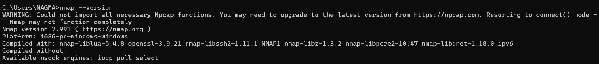
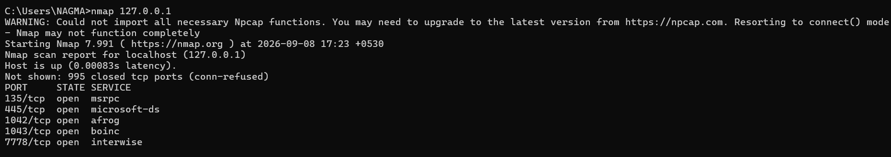
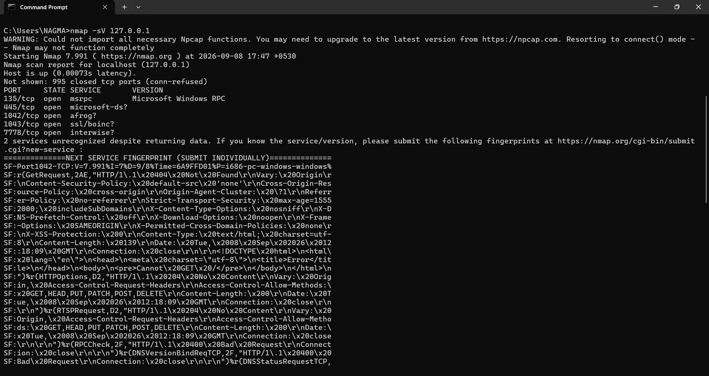

 # 🔎 Basic Network Scanning Using Nmap

## 📌 Project Overview

This project demonstrates a beginner-level network scanning exercise using **Nmap (Network Mapper)**.

The scan was performed on my own Windows computer using the localhost address `127.0.0.1`. The purpose was to identify open TCP ports, examine the services detected by Nmap, and understand potential security risks.

---

## 🎯 Objectives

* Understand the basics of network scanning.
* Learn how to use Nmap.
* Identify open TCP ports.
* Examine services associated with open ports.
* Understand potential security risks.
* Document and analyze scan results.
* Learn basic network security recommendations.

---

## 🛠️ Tools & Environment

| Item             | Details   |
| ---------------- | --------- |
| Tool             | Nmap      |
| Version          | 7.991     |
| Operating System | Windows   |
| Target           | 127.0.0.1 |
| Target Type      | Localhost |

`127.0.0.1` refers to the local computer on which the scan was performed.

---

## 💻 Commands Used

### 1. Check Nmap Installation

```cmd
nmap --version
```

### 2. Basic Port Scan

```cmd
nmap 127.0.0.1
```

### 3. Service and Version Detection

```cmd
nmap -sV 127.0.0.1
```

The `-sV` option allows Nmap to attempt to identify services and software versions associated with open ports.

---

## 📊 Scan Results

The scan identified one active host and five open TCP ports.

| Port | Protocol | State | Nmap Detection        |
| ---: | -------- | ----- | --------------------- |
|  135 | TCP      | Open  | Microsoft Windows RPC |
|  445 | TCP      | Open  | Microsoft-DS?         |
| 1042 | TCP      | Open  | afrog?                |
| 1043 | TCP      | Open  | ssl/boinc?            |
| 7778 | TCP      | Open  | interwise?            |

The scan also reported:

**995 TCP ports closed with connection refused.**

---

## 🔍 Findings

### Port 135 — Microsoft Windows RPC

Port 135 is commonly associated with Microsoft RPC services used by Windows components.

It should be appropriately protected by firewall and network configuration.

### Port 445 — Microsoft-DS / SMB

Port 445 is commonly associated with SMB, which is used for Windows file and printer sharing.

SMB should be properly secured and restricted to trusted networks when appropriate.

### Port 1042

Nmap associated this port with `afrog?`, but the question mark indicates that the identification was uncertain.

The service detection response showed HTTP behavior, including an HTTP 404 response. Therefore, a web-based service appears to be listening on this port, but the exact application was not confirmed.

### Port 1043

Nmap associated this port with `ssl/boinc?`, but the identification was uncertain.

The scan received HTTP-related responses over an SSL/TLS connection, suggesting that a web-based service may be listening on this port.

### Port 7778

Nmap associated this port with `interwise?`, but Nmap could not confidently identify the exact service.

Further investigation would be required to determine which application is using this port.

---

## ⚠️ Potential Security Risks

An open port does not automatically mean that a system is vulnerable.

The actual risk depends on the service, software version, configuration, firewall rules, and who can access the service.

Possible risks include:

* Unnecessary open ports increasing the attack surface.
* Outdated network services containing security vulnerabilities.
* Improperly configured file-sharing services.
* Unknown services that have not been investigated.
* Network services being accessible from untrusted networks.

---

## 🛡️ Security Recommendations

* Keep Windows and installed applications updated.
* Use and properly configure Windows Firewall.
* Disable unnecessary network services.
* Restrict file and printer sharing to trusted networks.
* Investigate unfamiliar open ports.
* Regularly review applications listening for network connections.
* Avoid exposing unnecessary services to untrusted networks.

---

## 📸 Screenshots

### Nmap Version

Shows that Nmap 7.991 was installed successfully.



### Basic Scan

Shows the open ports identified on the local computer.



### Service Detection

Shows the services detected by Nmap.



---

## 📄 Detailed Report

The complete exercise report is available here:

[Basic Network Scanning Report](Basic Network Scanning Report.pdf)

---

## 📚 What I Learned

Through this exercise, I learned:

* What network scanning is.
* How ports and services work.
* How to perform a basic Nmap scan.
* How to use service detection.
* How to interpret open and closed ports.
* Why open ports should be reviewed.
* Basic methods for reducing unnecessary network exposure.

---

## ⚖️ Ethical Consideration

This exercise was performed only on my own local computer.

Network scanning should only be performed on systems or networks that you own or have explicit authorization to test.

---

## ✅ Project Status

**Completed**

The project includes the Nmap scans, analysis, security recommendations, screenshots, and detailed report.
